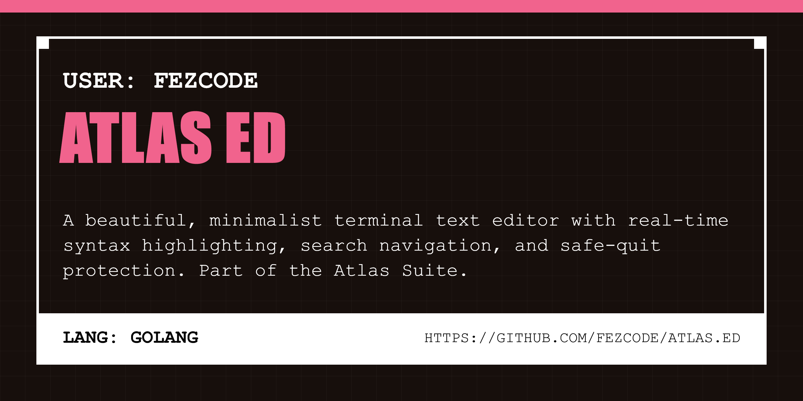

# atlas.ed ✍️

A beautiful, high-performance terminal text editor with syntax highlighting, line numbers, and search. Built with Go and the Atlas Suite philosophy.



## Overview

`atlas.ed` is a minimalist TUI text editor designed for speed and beauty. It provides a clean, keyboard-centric interface for editing code and text files directly in your terminal.

## Features

- **Editable Interface:** Powered by [Bubble Tea Textarea](https://github.com/charmbracelet/bubbles/tree/master/textarea).
- **Search:** Quickly find and jump to occurrences of text with `^F`.
- **Line Numbers:** Toggleable line numbers with `^L`.
- **Keyboard Centric:** Smooth editing, saving (`^S`), and navigation.
- **Minimalist:** Fast, dependency-light, and aesthetic.

## Installation

```bash
gobake build
```

## Usage

```bash
# Open or create a file
atlas.ed main.go

# Show version
atlas.ed -v
```

## TUI Controls

- **^S:** Save file
- **^F:** Search
- **^L:** Toggle line numbers
- **^Q:** Quit
- **n:** Next search match
- **p:** Previous search match
